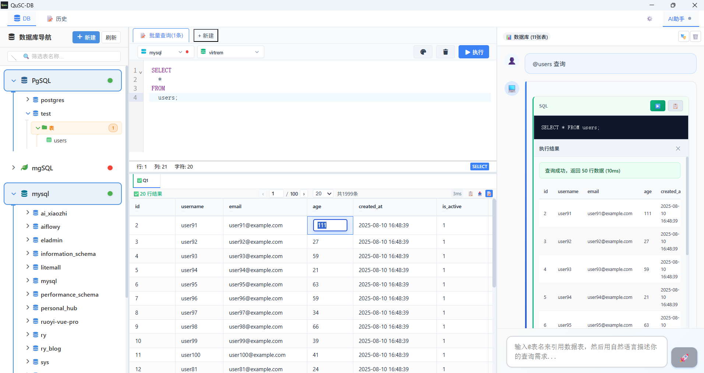

# QuSC-DB

> 现代化数据库管理工具，内置AI助手




## ✨ 特性

- 🗄️ **多数据库支持** - MySQL、Redis、MongoDB、PostgreSQL
- 🤖 **AI智能助手** - SQL生成、查询优化、错误解释
- 🎨 **现代化界面** - Vue 3 + 响应式设计
- ⚡ **轻量高效** - Tauri驱动，原生性能
- 🔐 **数据安全** - 本地存储，隐私保护

## 🚀 快速开始

### 安装依赖
```bash
npm install
```

### 开发模式
```bash
cargo tauri dev
```

### 构建应用
```bash
cargo tauri build
```

## 🛠️ 技术栈

**前端**
- Vue 3 + TypeScript
- Pinia 状态管理
- CodeMirror SQL编辑器
- SCSS样式

**后端**
- Rust + Tauri 2.0
- 异步数据库连接
- RESTful API设计

**数据库驱动**
- MySQL: `mysql_async`
- Redis: `redis`
- MongoDB: `mongodb`
- PostgreSQL: `tokio-postgres`

## 📋 系统要求

- Rust 1.89.0+
- Node.js 18+
- Windows 10+

## 🔧 开发

### 项目结构
```
qusc-db/
├── src/                 # Vue 前端源码
├── src-tauri/          # Rust 后端源码
├── public/             # 静态资源
└── dist/               # 构建输出
```


## 📝 更新日志

### v0.2.0 (当前版本)
- ✅ 完善数据库连接管理
- ✅ 优化右键菜单系统
- ✅ 改进用户界面响应性
- ✅ 添加功能开发状态提示
- ✅ 修复MongoDB菜单显示问题

### v0.1.0
- 🎉 首个版本发布
- 📦 基础数据库连接功能
- 🤖 AI助手集成

## 🤝 贡献

欢迎提交 Issues 和 Pull Requests！
